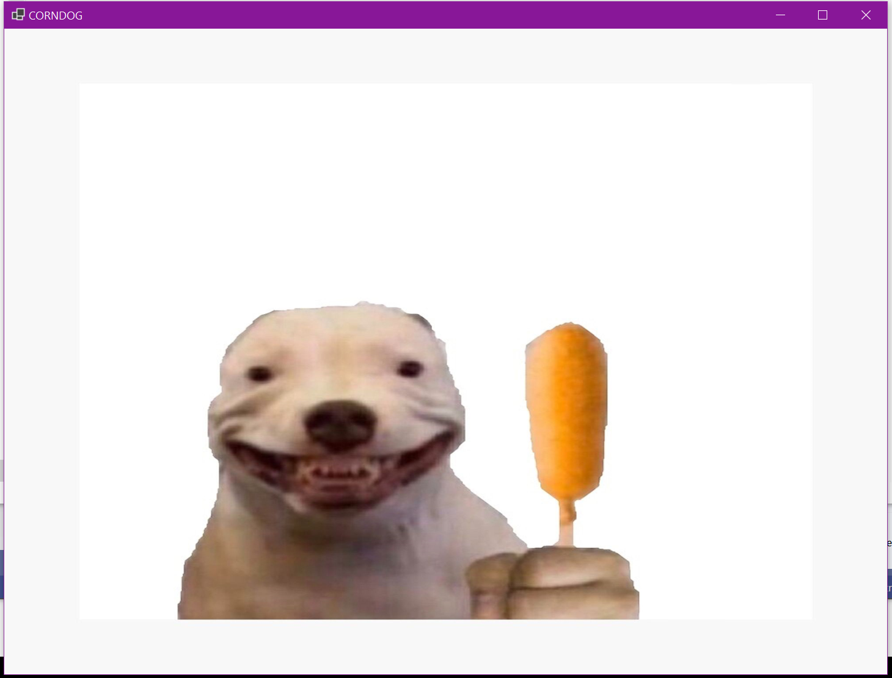

# CORNDOG.EXE

Having a corn dog emergency? Run this application.

## Screenshots

## Installation

- Prerequisite: corndogdog.jpg placed into the Resources subdirectory. As the license of the image is unknown, it cannot be distributed.
- Build with Visual Studio 2022 or the .NET SDK.
- Run .EXE (no further installation required)

## Features

- Shows a picture of a dog about to eat a corn dog
- Responsive design
- Simple UI for all ages
- Portable (no installation required)

## Licensing

- Source: MIT Licensed
- Image: Unknown license. Do not distribute.

## Roadmap

This application is considered feature-complete and stable. No features are currently on the roadmap.

## Authors

[@tinymisspoopie](https://bsky.app/profile/tinymisspoopie.bsky.social) - Director, Creator, Marketing and Promotion

[@natealism](https://bsky.app/profile/natealism.bsky.social) - Lead Software Engineer, Project Manager

## Acknowledgements

* Special thanks to @tinymisspoopie for [inspiration](https://bsky.app/profile/tinymisspoopie.bsky.social/post/3ka5ol2yb7b2q) and [creative direction](https://bsky.app/profile/tinymisspoopie.bsky.social/post/3ka5oqsqgk72l).
* Thank you to my spirit team for guidance on my corn dog journey.

